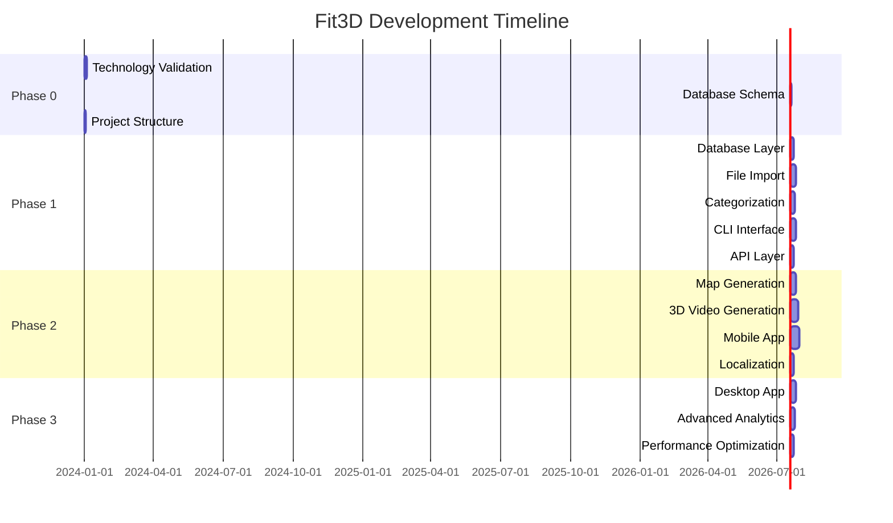

# Implementation Tasks

## Task Overview
This document outlines the implementation tasks for the Fit3D outdoor sports data management application, organized by development phases and priority levels.

## Phase 0: Foundation and Research (2 weeks)

### Task 0.1: Technology Stack Validation
**Priority:** High  
**Estimated Effort:** 3 days  
**Dependencies:** None

**Description:**
Validate the chosen technology stack and create proof of concepts for key components.

**Acceptance Criteria:**
- [ ] SQLite integration working with GPS data
- [ ] DuckDB analytical queries implemented
- [ ] FIT file parsing proof of concept
- [ ] GPX file parsing proof of concept
- [ ] Three.js 3D rendering working
- [ ] Mapbox GL JS integration working

**Implementation Guide:**
```typescript
// Create proof of concept for each technology
// 1. SQLite with spatial data
// 2. DuckDB analytical queries
// 3. File parsing libraries
// 4. 3D rendering pipeline
// 5. Map visualization
```

**Verification Criteria:**
- All proof of concepts demonstrate expected functionality
- Performance benchmarks meet requirements
- Cross-platform compatibility verified

### Task 0.2: Database Schema Design
**Priority:** High  
**Estimated Effort:** 2 days  
**Dependencies:** Task 0.1

**Description:**
Design and implement the complete database schema for SQLite and DuckDB.

**Acceptance Criteria:**
- [ ] SQLite schema with all tables and indexes
- [ ] DuckDB analytical schema
- [ ] Data migration scripts
- [ ] Performance optimization indexes
- [ ] Data validation constraints

**Implementation Guide:**
```sql
-- Implement schema from data-model.md
-- Create indexes for performance
-- Add constraints for data integrity
-- Test with sample data
```

**Verification Criteria:**
- Schema supports all required operations
- Performance tests pass with large datasets
- Data integrity constraints working

### Task 0.3: Project Structure Setup
**Priority:** Medium  
**Estimated Effort:** 1 day  
**Dependencies:** None

**Description:**
Set up the project structure with monorepo configuration and development tools.

**Acceptance Criteria:**
- [ ] Monorepo structure with shared packages
- [ ] TypeScript configuration
- [ ] ESLint and Prettier setup
- [ ] Jest testing configuration
- [ ] Build scripts and tooling

**Implementation Guide:**
```bash
# Set up monorepo structure
# Configure TypeScript
# Set up linting and formatting
# Configure testing framework
# Set up build pipeline
```

**Verification Criteria:**
- All development tools working
- Build process successful
- Tests running correctly

## Phase 1: Core Data Management (8 weeks)

### Task 1.1: Database Layer Implementation
**Priority:** High  
**Estimated Effort:** 5 days  
**Dependencies:** Task 0.2

**Description:**
Implement the database layer with SQLite and DuckDB integration.

**Acceptance Criteria:**
- [ ] Database connection management
- [ ] CRUD operations for all entities
- [ ] Transaction support
- [ ] Connection pooling
- [ ] Error handling and logging
- [ ] Data synchronization between SQLite and DuckDB

**Implementation Guide:**
```typescript
// Implement database service
class DatabaseService {
  // SQLite operations
  // DuckDB operations
  // Data synchronization
  // Error handling
}
```

**Verification Criteria:**
- All database operations working correctly
- Performance benchmarks met
- Error handling comprehensive

### Task 1.2: File Import System
**Priority:** High  
**Estimated Effort:** 7 days  
**Dependencies:** Task 1.1

**Description:**
Implement the file import system for FIT and GPX files.

**Acceptance Criteria:**
- [ ] FIT file parser implementation
- [ ] GPX file parser implementation
- [ ] File validation and error handling
- [ ] Progress tracking for large files
- [ ] Batch import functionality
- [ ] File metadata extraction

**Implementation Guide:**
```typescript
// Implement file parsers
class FitParser {
  // Parse FIT files
  // Extract GPS data
  // Extract metadata
}

class GpxParser {
  // Parse GPX files
  // Extract GPS data
  // Extract metadata
}
```

**Verification Criteria:**
- All supported file formats import correctly
- Error handling for corrupted files
- Performance with large files acceptable

### Task 1.3: Activity Categorization Engine
**Priority:** High  
**Estimated Effort:** 6 days  
**Dependencies:** Task 1.2

**Description:**
Implement the automatic activity categorization system.

**Acceptance Criteria:**
- [ ] GPS pattern analysis for hiking detection
- [ ] Speed and cadence analysis for cycling detection
- [ ] Confidence scoring system
- [ ] Manual override capability
- [ ] Category-specific metadata extraction
- [ ] Extensible architecture for new categories

**Implementation Guide:**
```typescript
// Implement categorization engine
class CategorizationEngine {
  // Analyze GPS patterns
  // Detect activity type
  // Calculate confidence
  // Extract metadata
}
```

**Verification Criteria:**
- 95% accuracy in automatic categorization
- Manual override working correctly
- Extensible architecture implemented

### Task 1.4: CLI Interface Implementation
**Priority:** High  
**Estimated Effort:** 8 days  
**Dependencies:** Task 1.3

**Description:**
Implement the command-line interface with web technologies.

**Acceptance Criteria:**
- [ ] Command structure with Commander.js
- [ ] Interactive prompts with Inquirer.js
- [ ] Rich terminal output with Chalk
- [ ] All core commands implemented
- [ ] Help system and documentation
- [ ] Error handling and user feedback

**Implementation Guide:**
```typescript
// Implement CLI commands
// Import command
// List command
// Show command
// Update command
// Delete command
// Map command
// Video command
```

**Verification Criteria:**
- All CLI commands working correctly
- User experience intuitive
- Error messages clear and helpful

### Task 1.5: API Layer Implementation
**Priority:** Medium  
**Estimated Effort:** 5 days  
**Dependencies:** Task 1.4

**Description:**
Implement the REST API layer for future web and mobile interfaces.

**Acceptance Criteria:**
- [ ] Express.js server setup
- [ ] All API endpoints implemented
- [ ] Request validation and error handling
- [ ] Response formatting
- [ ] API documentation
- [ ] Rate limiting and security

**Implementation Guide:**
```typescript
// Implement API routes
// Activity management endpoints
// Category management endpoints
// Visualization endpoints
// Analytics endpoints
```

**Verification Criteria:**
- All API endpoints working correctly
- Request validation comprehensive
- API documentation complete

## Phase 2: Visualization and Mobile (10 weeks)

### Task 2.1: Map Generation Engine
**Priority:** High  
**Estimated Effort:** 8 days  
**Dependencies:** Task 1.5

**Description:**
Implement the map trajectory generation system.

**Acceptance Criteria:**
- [ ] Mapbox GL JS integration
- [ ] Multiple map styles support
- [ ] Elevation and speed overlays
- [ ] Custom color schemes
- [ ] High-resolution export
- [ ] Category-specific styling

**Implementation Guide:**
```typescript
// Implement map generation
class MapGenerator {
  // Generate map with GPS data
  // Apply styling options
  // Export high-resolution images
}
```

**Verification Criteria:**
- Maps generated correctly for all activity types
- Styling options working
- Export quality meets requirements

### Task 2.2: 3D Video Generation Engine
**Priority:** High  
**Estimated Effort:** 10 days  
**Dependencies:** Task 2.1

**Description:**
Implement the 3D motion tracking video generation system.

**Acceptance Criteria:**
- [ ] Three.js 3D scene setup
- [ ] Camera control and animation
- [ ] Terrain generation from GPS data
- [ ] Image insertion capability
- [ ] Video export functionality
- [ ] Performance optimization

**Implementation Guide:**
```typescript
// Implement 3D video generation
class VideoGenerator {
  // Create 3D scene
  // Animate camera
  // Generate terrain
  // Insert images
  // Export video
}
```

**Verification Criteria:**
- 3D videos generated correctly
- Camera controls working
- Image insertion functional
- Export quality acceptable

### Task 2.3: React Native Mobile App
**Priority:** High  
**Estimated Effort:** 12 days  
**Dependencies:** Task 2.2

**Description:**
Implement the mobile application using React Native.

**Acceptance Criteria:**
- [ ] React Native project setup
- [ ] Navigation and routing
- [ ] Activity list and details screens
- [ ] Map visualization
- [ ] Basic video playback
- [ ] Offline data access

**Implementation Guide:**
```typescript
// Implement mobile app
// Navigation setup
// Screen components
// Data integration
// Offline support
```

**Verification Criteria:**
- Mobile app working on iOS and Android
- All core features accessible
- Offline functionality working

### Task 2.4: Chinese Localization
**Priority:** High  
**Estimated Effort:** 4 days  
**Dependencies:** Task 2.3

**Description:**
Implement comprehensive Chinese localization.

**Acceptance Criteria:**
- [ ] i18next integration
- [ ] Chinese language pack
- [ ] Date/time formatting
- [ ] Number formatting
- [ ] UI text translation
- [ ] Error message translation

**Implementation Guide:**
```typescript
// Implement localization
// Translation files
// Formatting functions
// UI integration
```

**Verification Criteria:**
- All UI text in Chinese
- Formatting correct for Chinese locale
- Error messages translated

## Phase 3: Desktop and Advanced Features (6 weeks)

### Task 3.1: Electron Desktop App
**Priority:** Medium  
**Estimated Effort:** 8 days  
**Dependencies:** Task 2.4

**Description:**
Implement the desktop application using Electron.

**Acceptance Criteria:**
- [ ] Electron project setup
- [ ] Web-based UI integration
- [ ] Native file system access
- [ ] System tray integration
- [ ] Auto-updater implementation
- [ ] Cross-platform builds

**Implementation Guide:**
```typescript
// Implement desktop app
// Electron setup
// UI integration
// Native features
// Build configuration
```

**Verification Criteria:**
- Desktop app working on Windows, macOS, Linux
- Native features functional
- Auto-updater working

### Task 3.2: Advanced Analytics
**Priority:** Medium  
**Estimated Effort:** 6 days  
**Dependencies:** Task 3.1

**Description:**
Implement advanced analytics and reporting features.

**Acceptance Criteria:**
- [ ] Performance trend analysis
- [ ] Comparative analytics
- [ ] Export functionality
- [ ] Custom report generation
- [ ] Data visualization
- [ ] Statistical analysis

**Implementation Guide:**
```typescript
// Implement analytics
// Trend analysis
// Comparative reports
// Export functionality
// Visualization components
```

**Verification Criteria:**
- Analytics working correctly
- Reports generated accurately
- Export functionality complete

### Task 3.3: Performance Optimization
**Priority:** Medium  
**Estimated Effort:** 4 days  
**Dependencies:** Task 3.2

**Description:**
Optimize performance for large datasets and complex operations.

**Acceptance Criteria:**
- [ ] Database query optimization
- [ ] Memory usage optimization
- [ ] 3D rendering optimization
- [ ] File processing optimization
- [ ] Caching implementation
- [ ] Background processing

**Implementation Guide:**
```typescript
// Implement optimizations
// Query optimization
// Memory management
// Caching strategies
// Background processing
```

**Verification Criteria:**
- Performance benchmarks met
- Memory usage optimized
- Large dataset handling improved

## Testing Tasks

### Task T.1: Unit Testing
**Priority:** High  
**Estimated Effort:** 8 days  
**Dependencies:** Throughout development

**Description:**
Implement comprehensive unit tests for all components.

**Acceptance Criteria:**
- [ ] 90% code coverage achieved
- [ ] All business logic tested
- [ ] Database operations tested
- [ ] File processing tested
- [ ] API endpoints tested
- [ ] Error scenarios tested

### Task T.2: Integration Testing
**Priority:** High  
**Estimated Effort:** 4 days  
**Dependencies:** Task T.1

**Description:**
Implement integration tests for system components.

**Acceptance Criteria:**
- [ ] Database integration tests
- [ ] File import integration tests
- [ ] API integration tests
- [ ] Cross-component tests
- [ ] Performance integration tests

### Task T.3: End-to-End Testing
**Priority:** Medium  
**Estimated Effort:** 6 days  
**Dependencies:** Task T.2

**Description:**
Implement end-to-end tests for complete user workflows.

**Acceptance Criteria:**
- [ ] Complete import workflow tests
- [ ] Visualization generation tests
- [ ] Cross-platform tests
- [ ] Performance tests
- [ ] User interface tests

## Documentation Tasks

### Task D.1: API Documentation
**Priority:** Medium  
**Estimated Effort:** 3 days  
**Dependencies:** Task 1.5

**Description:**
Create comprehensive API documentation.

**Acceptance Criteria:**
- [ ] OpenAPI specification
- [ ] Interactive API documentation
- [ ] Code examples
- [ ] Error code documentation
- [ ] Authentication guide

### Task D.2: User Documentation
**Priority:** Medium  
**Estimated Effort:** 4 days  
**Dependencies:** Task 3.3

**Description:**
Create user documentation and guides.

**Acceptance Criteria:**
- [ ] User manual
- [ ] Quick start guide
- [ ] Video tutorials
- [ ] FAQ section
- [ ] Troubleshooting guide

## Deployment Tasks

### Task Deploy.1: Build System
**Priority:** Medium  
**Estimated Effort:** 3 days  
**Dependencies:** Task 3.3

**Description:**
Set up automated build and deployment system.

**Acceptance Criteria:**
- [ ] CI/CD pipeline
- [ ] Automated testing
- [ ] Cross-platform builds
- [ ] Release automation
- [ ] Distribution setup

### Task Deploy.2: Distribution
**Priority:** Low  
**Estimated Effort:** 2 days  
**Dependencies:** Task Deploy.1

**Description:**
Set up distribution channels for all platforms.

**Acceptance Criteria:**
- [ ] App store submissions
- [ ] Website distribution
- [ ] Update mechanisms
- [ ] User feedback system
- [ ] Analytics integration

## Task Dependencies and Timeline



## Risk Mitigation

### High-Risk Tasks
- **3D Video Generation**: Complex WebGL implementation, requires fallback options
- **Cross-Platform Compatibility**: Extensive testing required across all platforms
- **Performance with Large Datasets**: Optimization and caching strategies needed

### Mitigation Strategies
- Early prototyping for complex features
- Continuous testing on target platforms
- Performance benchmarking throughout development
- User feedback integration
- Incremental delivery approach
